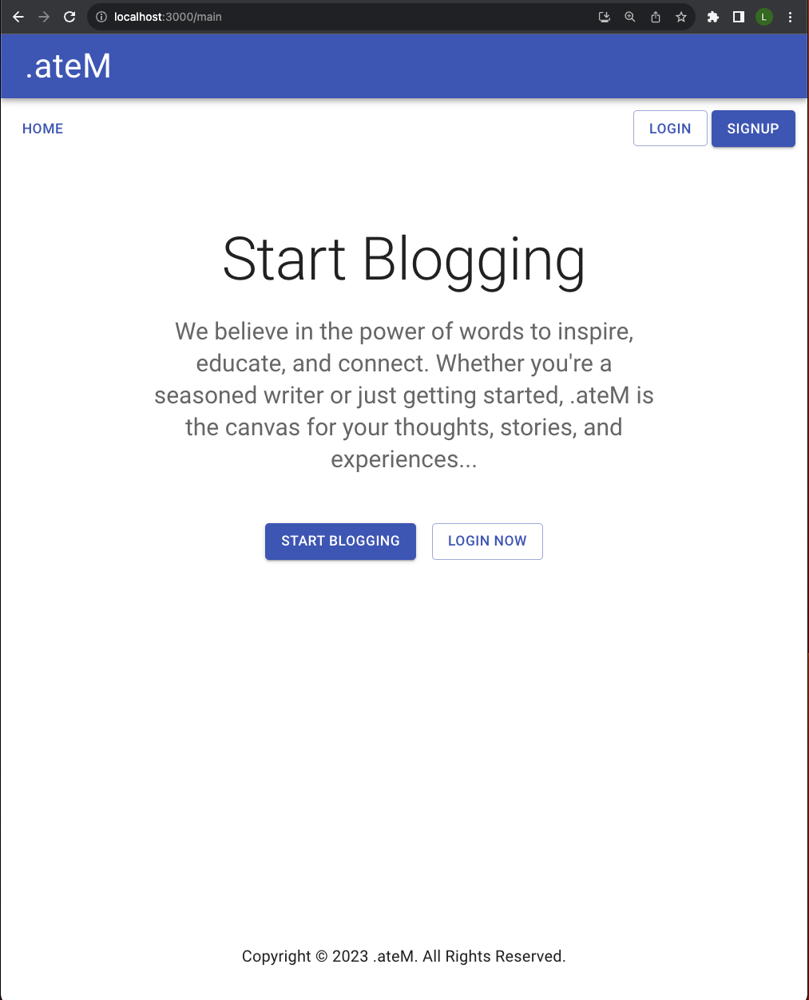
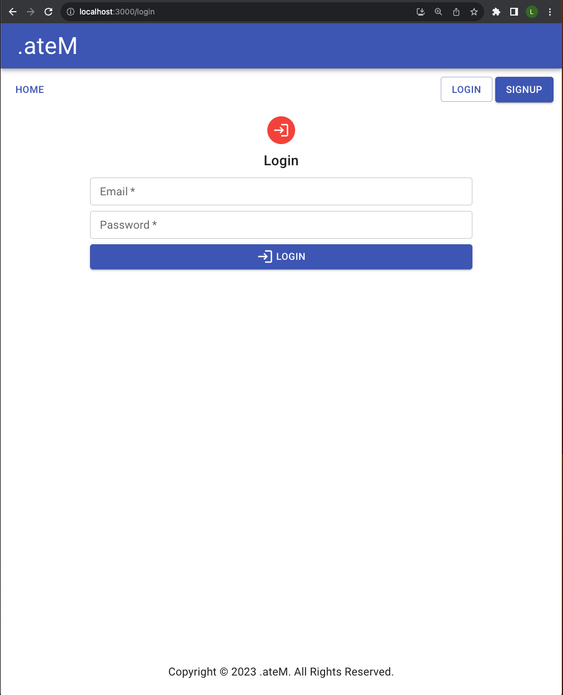
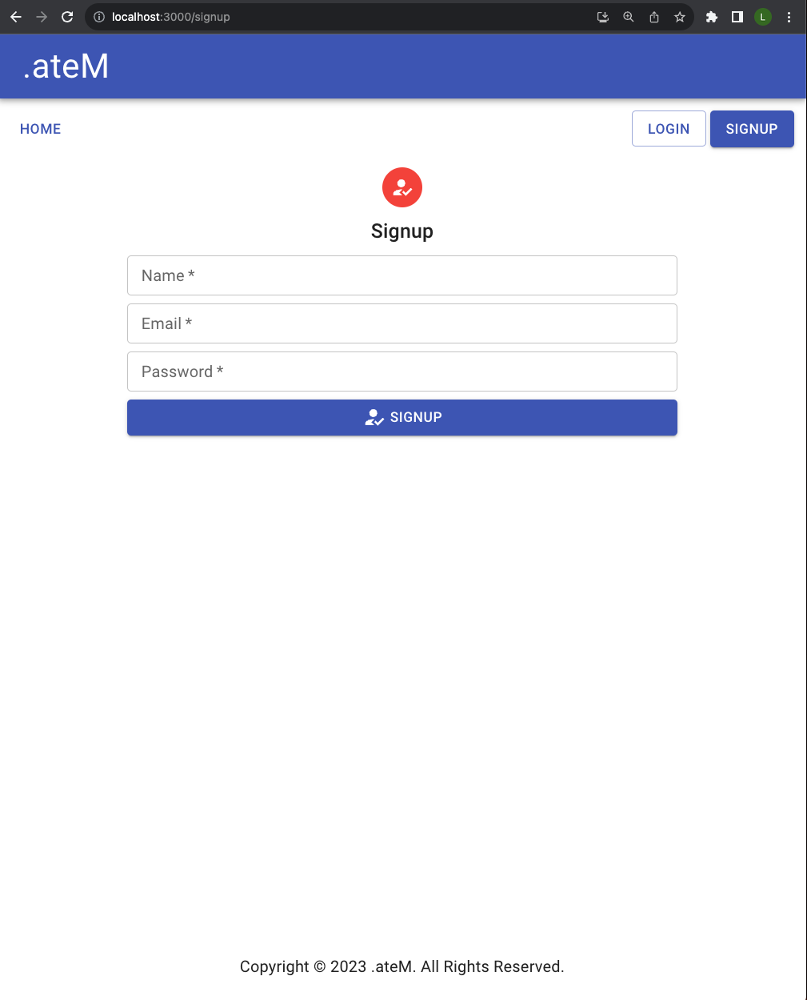
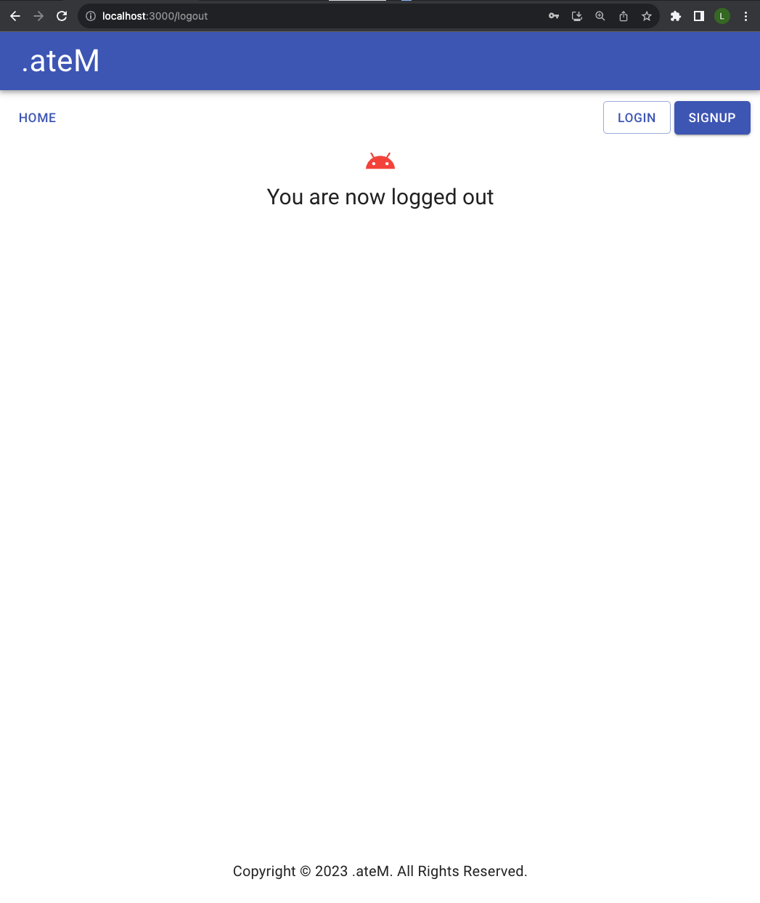
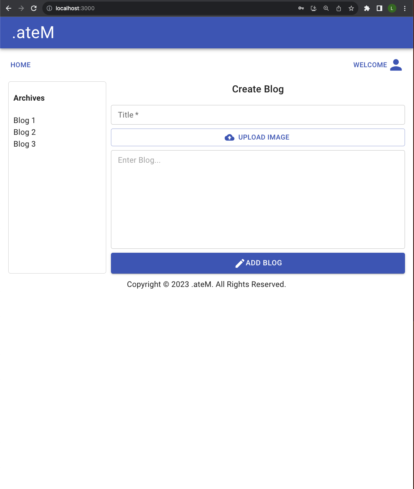
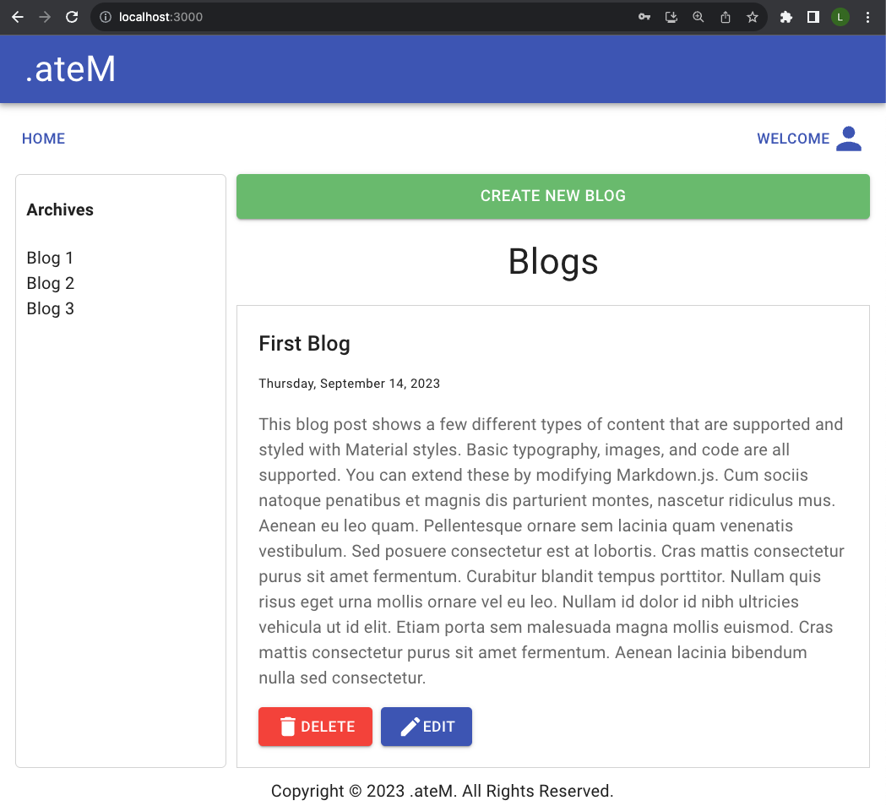
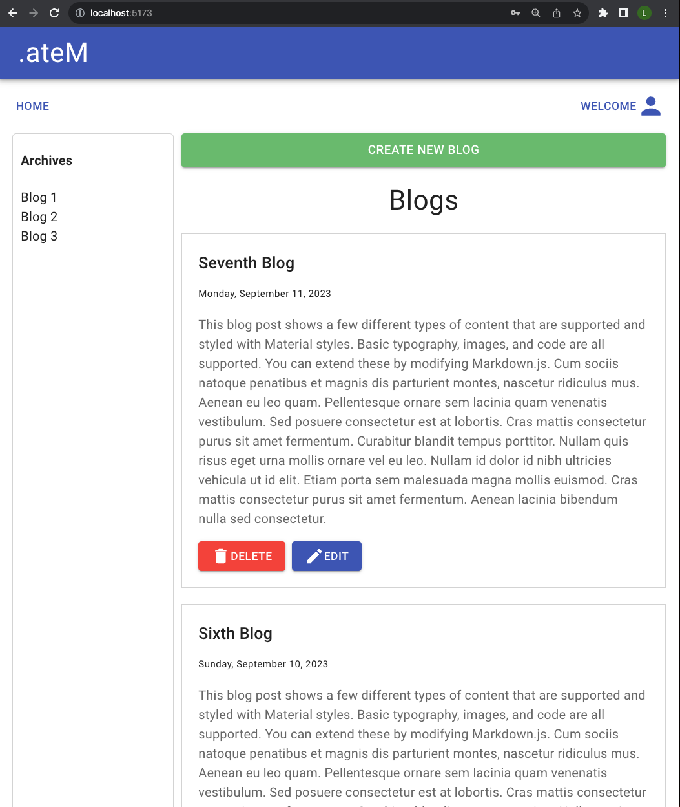
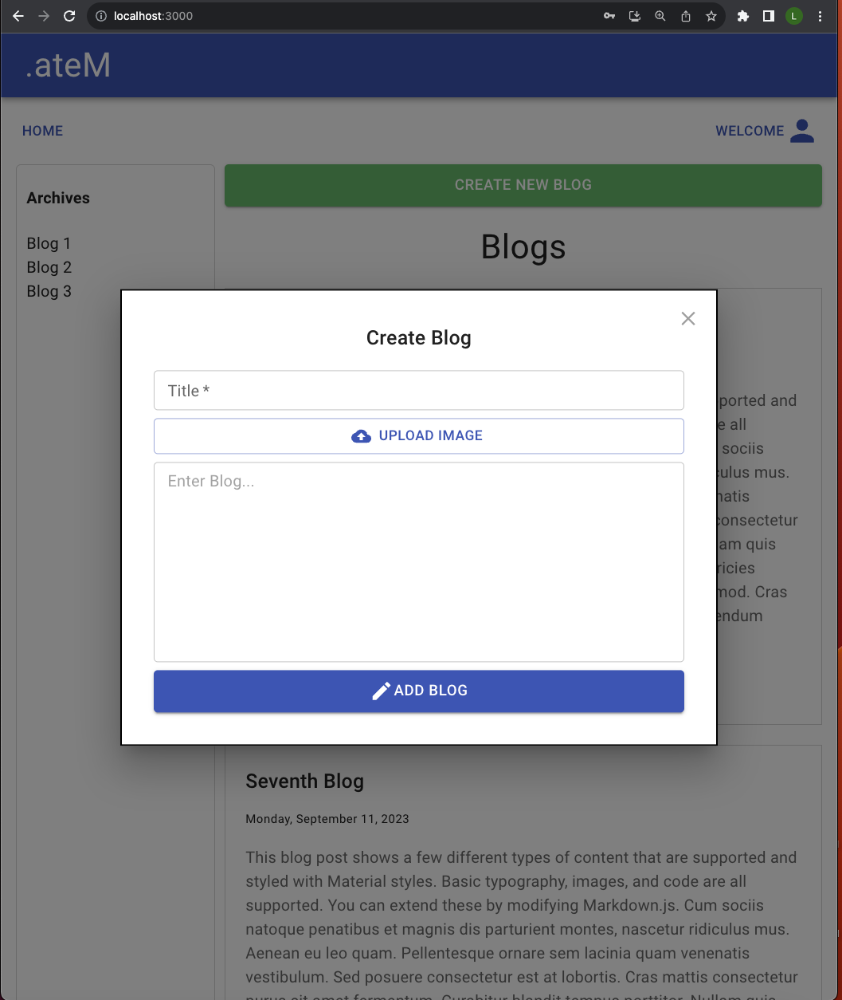
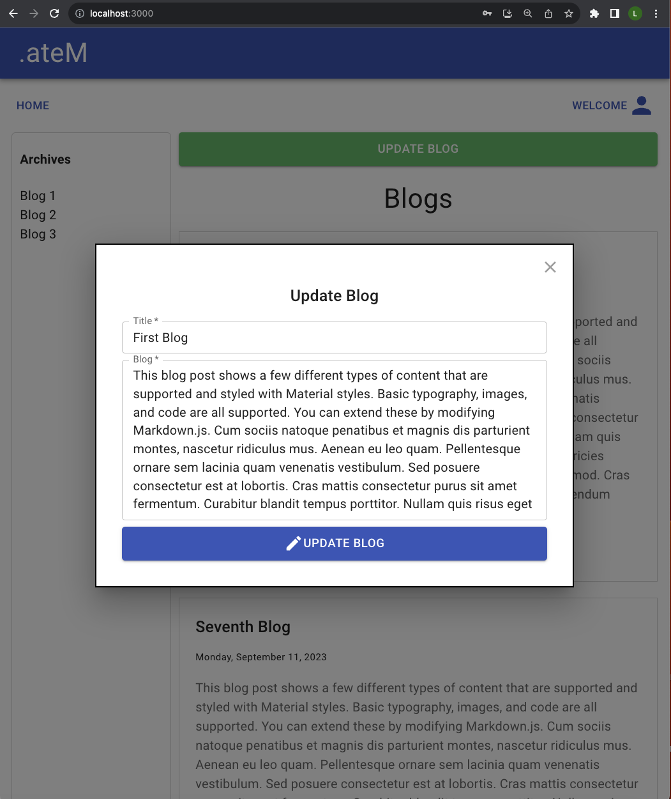

# Introduction
Welcome to .ateM, 
A blog site which can evolve into a full blown social media website by adding additonal features and improving upon current features. You can login, and register using jsonwebtoken authentication. Passwords are encrypted using Bcrypt and saved to MongoDB in the cloud. The Layout/Design is created utilizing Material UI's framework which has a clean and simple appearance. I have included both Vite and Create React App frontend. Feel free to download and use the code as you please. If you find any bugs or have any suggestions to improve this blog app, let me know. Thanks again for checking it out!

# Main Page


# Login Page


# Signup Page


# Logout Page


# Loggedin Main Page


# Display users single blog


# Display user's multiple blogs


# Create Blog using Modal


# Update Blog using Modal



# Technologies Used
## GitHub for version control and repository
- [GitHub] (https://github.com/)


## CI/CD Deployment (Work in progress)
- [Heroku] (https://id.heroku.com/login)


## Backend
- [Mongoose] (https://mongoosejs.com/docs/index.html)
```
npm i --save mongoose
```


## MongoDB for database in the cloud
- [MongoDB] (https://www.mongodb.com/)


### Express is a Web Application Framework used for the backend
- [Express] (https://expressjs.com/en/starter/installing.html)
```
npm i --save express
```


### To store password, api keys and sensitive data out of our code
- [Dotenv] (https://www.npmjs.com/package/dotenv)
```
npm i --save dotenv nodemon
```


### Nodemon will restart server after each code change to prevent us from manually restarting
- [Nodemon] (https://nodemon.io/)
```
npm i --save nodemon
```


### Gives users the ability to upload images
- [Multer] (https://github.com/expressjs/multer#readme)
```
npm i --save multer
```


### Provides a Connect/Express middleware that can be used to enable CORS with various options
- [Cors] (https://github.com/expressjs/cors#readme)
```
npm i --save cors
```


## Frontend frameworks using vite or create-react-app
### To run Vite 
- client folder: Vite
```
npm run dev
```


### To run create-react-app
- frontend folder: create-react-app
```
npm start
```


### Fetch data from MondoDB
[MongoDB] (https://axios-http.com/docs/intro)
```
npm i --save axios
```


### Encrypt user password
- [Bcryptjs] (https://www.npmjs.com/package/bcryptjs)
- [BcryptjsGitHub] (https://github.com/dcodeIO/bcrypt.js)
```
npm i --save bcryptjs
```


### Authenticate with jsonwebtoken
- [JSONWEBTOKEN] (https://www.npmjs.com/package/jsonwebtoken)
```
npm i --save jsonwebtoken
```


### Cookies to store authentication token
- [Cookies] (https://www.npmjs.com/package/cookie-parser)
- [CookiesGitHub] (https://github.com/expressjs/cookie-parser)
```
npm i --save cookie-parser
```


### React-Router for routing pages
- [React-Router] (https://v5.reactrouter.com/web/guides/quick-start)
```
npm i --save react-router-dom
```


#  Layout and Design Framework
### Material UI 
- [Material UI] (https://mui.com/material-ui/getting-started/installation/)
```
npm install @mui/material 
npm install @emotion/react 
npm install @emotion/styled
npm install @fontsource/roboto
npm install @mui/icons-material
```


# Getting Started
- Trello Board [https://trello.com/b/litvpJqZ/mern-blog-app]
- GitHub [https://github.com/lchen104/mern-blog]


# Unsolved Problems (Additional Features)
- Add an image upload feature to blog about (Currently working on)
- Add user name on welcome message in navbar (Currently working on)
- Add blog archives and list previous blogs on aside navbar on the left column (Currently working on)

# Future Enhancements
- Add user profile section
- Add user avatar upload feature and display when logged in
- Add user friends who are also registered so user can also view friends blogs on the users main feed 
- Add user likes for each blog
- Added user comments for each blog